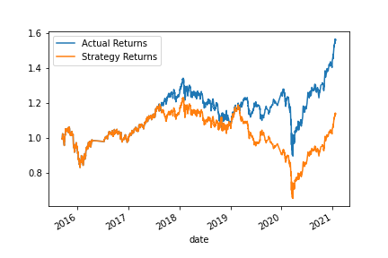

# module_14_challenge

For SVM when the window size changes the total accuracy will stay relatively the same of 55% but the values of percision, recall, and f1-score will change. I ran 3 test one with a significant increase from 100 to 360 for long and 10 for short, in this case the f1 score increase for the -1 signal by .01 which is insignificant much like this score the other catergories had minute changes. When I increased the short window to 20 and long to 200 the accuarcy was still 55 but the recall for -1 was higher went from .07 to .22 also recall increase by .11 percision had a slight increase. The Final product was an extreme small window 2 and 25. In this window set accuarcy dropped by 1% and the numbers moved slightly but nothing was drastic. It looks like the best window I used was 20 and 200 due to higher recall and f1-score.

original Plot:

Using 20 and 200 

Using 10 and 360

## Using ADA Boost
The original Dataset had a lower accuarcy rating then SVM the rating was 52%. We see the numbers tended to be more tight together between 1 and -1, in SVM the spread was quite large. In using the best window we had for SVM 20 and 200 our accuarcy has dropped by 4% which is now at 50%. One thing to note on this is the first inverse for 1 and -1 the Recall for -1 is higher than 1. With putting short to 10 and long to 360 we do see accuarcy going up to 52%, and with increasing the spread of the window to 2 short and 500 long accuracy has greatly dropped to 45%. One final test is to make this model have a tight window to see if that would help, and with having 25 and 100 accuracy only went to 52%.

original Plot:

Using 20 and 200 

Using 10 and 360

Bonus Tight window 25 and 100

## My Reccomendation 

I like the ADA classisfier witha  tight window we see the beginning data is on par with actual returns, but we see it shine the second half of the dates. witha drastic return increase I believe this would be the best to offer clients.
